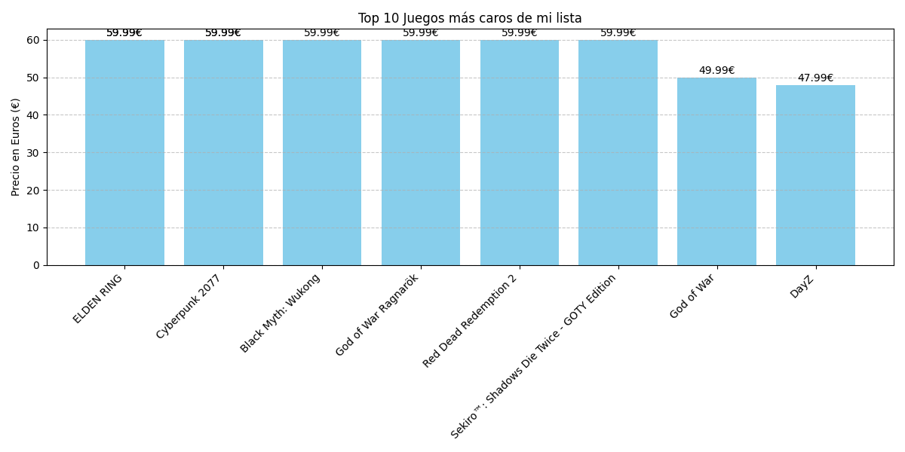

# 🎮 Steam Price Tracker - Data Science Project

Este proyecto automatiza el seguimiento de precios de juegos en Steam utilizando Python y análisis de datos.

## 🚀 Funcionalidades
* **Rastreo Masivo**: Consulta automática de precios para una lista de 50 juegos a través de la API de Steam.
* **Base de Datos**: Almacenamiento organizado en archivos CSV.
* **Visualización**: Generación automática de gráficas de barras con los precios actuales.

## 📊 Visualización de Resultados

## 🛠️ Tecnologías
* **Python**: Lógica principal y conexión con API.
- **Pandas**: Limpieza y procesamiento de datos.
- **Matplotlib**: Creación de gráficas profesionales.
